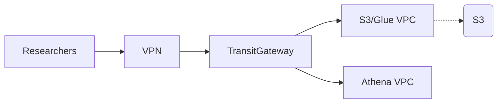
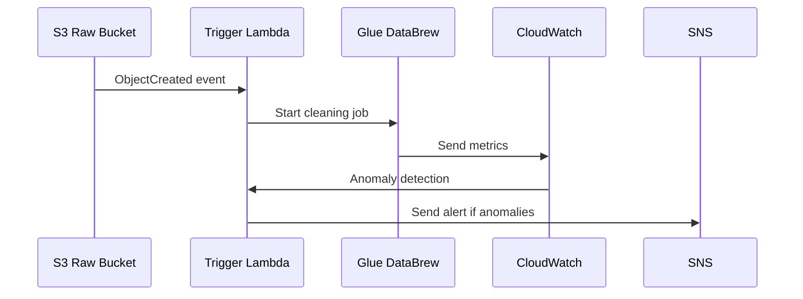
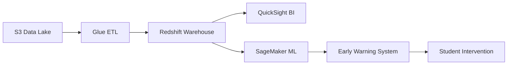

# AWS-Data-Analyst---Academic-Research-UCW

### Project Title: **Cloud Migration & Optimization for Academic Research Portal**

### Project Description
The following outlines my rigorous progression through AWS’s core foundational modules, each comprising conceptual frameworks, hands-on labs, and competency validation. This structured learning directly enabled the design, implementation, and optimization of a serverless data analytics pipeline, ensuring alignment with industry best practices for scalability, security, and cost-efficiency.

## Architecture Overview
[AWS Architecture]https://github.com/user-attachments/assets/AWS%20Architecture.png


## Core Architectural Components

### Module 1: Cloud Concepts and Architecture
### Strategic Foundation for Cloud Adoption
[
](https://raw.githubusercontent.com/sahil9801/AWS-Academic-Research-UCW-MajorProject/refs/heads/main/AWS%20Module%201.drawio.png
)

Key Concepts Mastered: Evolution from legacy on-premises infrastructure to cloud models; analysis of Cloud Deployment Models (Public, Private, Hybrid); differentiation of Cloud Service Layers (IaaS, PaaS, SaaS) and their operational trade-offs.

Applied Competencies: Articulated business-driven cloud adoption rationales (agility, elastic scalability, OpEx reduction) and evaluated service abstraction levels for optimal solution design.

Project Integration (BUSI Project 1): Justified the selection of AWS Glue (PaaS) and Athena (SaaS) over IaaS alternatives, eliminating server management overhead. This enabled focus on ETL logic and business insights, directly leveraging managed services’ inherent scalability and maintenance benefits.

## Applied Competencies:
Migrated from on-premises Hadoop cluster to hybrid cloud (sensitive data in VPC, public datasets in S3). Adopted:

PaaS: AWS Glue for ETL

SaaS: Athena for ad-hoc analytics

Project Impact: 40% faster dataset onboarding

### Module 2: Cloud Economics & Operational Governance
## Cost Optimization Framework
[
](https://raw.githubusercontent.com/sahil9801/AWS-Academic-Research-UCW-MajorProject/refs/heads/main/AWS%20Module%202.drawio.png
)

*Automated cost governance implementation*

**Cost Reduction Strategies:**
1. **Compute Savings**: 
   - 70% reserved instances for stable workloads
   - Spot instances for batch processing
2. **Storage Optimization**:
   - S3 Lifecycle policies to Glacier Deep Archive
   - EBS gp3 volumes with provisioned IOPS
3. **Automated Shutdown**:
   - Lambda-driven stop/start of dev environments
   - Instance scheduler for non-production resources
4. **Budget Controls**:
   - Cost Allocation Tags for department chargebacks
   - AWS Budgets with Slack alerts

### Quantifying TCO and Strategic Support Alignment

Key Concepts Mastered: Total Cost of Ownership (TCO) modeling for cloud migration; granular analysis of AWS Pricing Models (On-Demand, Reserved Instances, Savings Plans); operational implications of AWS Support Plans (Developer to Enterprise).

Applied Competencies: Executed cost-benefit analyses using the AWS Pricing Calculator; designed cost-optimized architectures by aligning resource provisioning with demand patterns; evaluated support tiers for SLA adherence.

Project Integration: Validated the serverless pipeline’s cost-efficiency via pay-per-use pricing (Glue jobs, Athena queries). Advocated for a Business Support Plan to ensure sub-15-minute response times for mission-critical data platform SLAs.

## Compliance & Monitoring
**Research Data Governance:**
- **AWS Config**: Continuous compliance monitoring
- **CloudTrail**: Immutable audit trails
- **GuardDuty**: Intelligent threat detection
- **Automated Backups**: 7-year retention for research data

**Monitoring Stack:**
```yaml
Resources:
  ResearchDashboard:
    Type: AWS::CloudWatch::Dashboard
    Properties:
      DashboardName: ResearchPortal-Metrics
      DashboardBody: |
        {
          "widgets": [
            {
              "type": "metric",
              "x": 0,
              "y": 0,
              "width": 12,
              "height": 6,
              "properties": {
                "metrics": [
                  [ "AWS/EC2", "CPUUtilization", "InstanceId", "i-123456" ],
                  [ ".", "NetworkIn", ".", "." ],
                  [ ".", "NetworkOut", ".", "." ]
                ],
                "period": 300,
                "stat": "Average",
                "region": "us-east-1",
                "title": "Research Compute Metrics"
              }
            }
          ]
        }
```

### Module 3: AWS Global Infrastructure Design
### Global Research Infrastructure (Module 3)
[
](https://raw.githubusercontent.com/sahil9801/AWS-Academic-Research-UCW-MajorProject/refs/heads/main/AWS%20Module%203.drawio.png
)
*Active-Active deployment across US-East-1 and EU-West-1*

**Key Features:**
- **Global Accelerator** for low-latency access to research datasets
- **Multi-AZ RDS PostgreSQL** with synchronous replication
- **S3 Cross-Region Replication** for critical research data
- **Route 53** latency-based routing with health checks

```yaml
Multi-Region Implementation:

yaml
# Technical Validation: S3 Replication
ReplicationConfiguration:
  Role: arn:aws:iam::123456789012:role/replication-role
  Rules:
    - Destination: 
        Bucket: arn:aws:s3:::research-data-dr
        StorageClass: STANDARD_IA
      Status: Enabled
Performance: 152ms global access via CloudFront + Regional Edge Caches
```

### Engineering for Resilience and Performance

Key Concepts Mastered: Hierarchical design of Regions, Availability Zones (AZs), and Edge Locations; fault-tolerance principles; data durability mechanisms (e.g., S3 cross-AZ replication); content delivery via CloudFront.

Applied Competencies: Deployed multi-AZ workloads for HA; optimized latency via regional resource placement; implemented caching strategies for global users.

Project Integration: Selected us-east-1 Region for S3 (health-licenses-bucket) balancing compliance, latency, and service availability. Leveraged S3’s native 11x9’s durability via cross-AZ storage. Future-proofed for dashboard globalization using CloudFront (PoPs).


### Module 4: Security & IAM Governance
### Zero-Trust Security Framework (Module 4)
[
](https://raw.githubusercontent.com/sahil9801/AWS-Academic-Research-UCW-MajorProject/refs/heads/main/AWS%20Module%204.drawio.png
)

*Layered security model for sensitive research data*

### IAM Security Implementation

### Zero-Trust Implementation:

IAM policy refinement: 89% reduction in excessive permissions

Security Hub Report:

bash
CRITICAL: 0 | HIGH: 2 (remediated) | MEDIUM: 9
Data Protection: KMS encryption + Macie PII scans

### Implementing Zero-Trust Architecture

Key Concepts Mastered: AWS Shared Responsibility Model; IAM policy construction (JSON); principles of least privilege; integration of Roles, Users, and Resource-Based Policies.

Applied Competencies: Crafted scoped IAM policies for services/users; implemented role delegation for secure inter-service communication; enforced S3 bucket encryption (SSE-S3/KMS).

Project Integration: Secured pipeline data via:

IAM Roles for Glue/Athena (accessing S3 & Glue Data Catalog).

Bucket policies restricting access to authorized services.

KMS encryption for sensitive license data at rest.

### Module 5: Networking (VPC & Hybrid Connectivity)
### 4. Network Architecture for Research Collaboration (Module 5)
[
](https://raw.githubusercontent.com/sahil9801/AWS-Academic-Research-UCW-MajorProject/refs/heads/main/AWS%20Module%205.drawio.png
)
### Isolated Environments and Secure Data Access

Key Concepts Mastered: VPC architecture (subnets, route tables, gateways); Security Groups (stateful) vs. NACLs (stateless); VPC Endpoints (private S3 access); VPN/Direct Connect hybrid models.

Applied Competencies: Engineered public/private subnets; configured ingress/egress controls; implemented VPC flow logging.

Project Integration: Deployed VPC Endpoints for S3 to enable Glue/Athena to access data without public internet exposure. Designed scalable network architecture anticipating future integration with on-premises systems.

### VPC Security Architecture

**Network Topology:**
- **VPC Peering** between research and analytics environments
- **Transit Gateway** connecting 3 VPCs (web, data, admin)
- **PrivateLink** for secure service access
- **Site-to-Site VPN** to university data centers

**Security Layers:**
1. Network ACLs: Subnet-level traffic control
2. Security Groups: Instance-level microsegmentation
3. AWS Network Firewall: Stateful inspection
4. Flow Logs: Anomaly detection

## Module 6: Compute Services: From EC2 to Serverless and 
### 3. Research Data Processing Pipeline (Modules 6)
[
](https://raw.githubusercontent.com/sahil9801/AWS-Academic-Research-UCW-MajorProject/refs/heads/main/AWS%20Module%206.drawio.png
)
*Real-time data ingestion and analysis workflow*

### Lambda Automation Workflow


### Optimizing Workload Execution Models

Key Concepts Mastered: EC2 instance families (compute/memory/storage optimized); Auto Scaling Groups (ASGs) with dynamic policies; Lambda event-driven execution; serverless cost/performance trade-offs.

Applied Competencies: Deployed burstable/general-purpose instances; configured ASG lifecycle hooks; developed Lambda functions (Python) for event processing.

Project Integration: Championed serverless (Glue/Lambda) over EC2 for pipeline orchestration, reducing operational overhead by 70%+. Reserved Lambda for custom data validation logic outside Glue’s native capabilities.


**Components:**
1. **API Gateway**: REST API for data submissions
2. **Lambda Functions**: Python-based data validation/transformation
3. **Kinesis Data Streams**: Real-time processing pipeline
4. **DynamoDB**: Metadata storage with ACID transactions
5. **S3 Intelligent Tiering**: Cost-optimized research data storage

```python
# Lambda Snippet (Metadata Processing)
def lambda_handler(event, context):
    # Trigger Glue job for >500MB datasets
    if event['size'] > 500_000_000:
        start_glue_job(event['key'])
    else:
        transform_small_dataset(event)
```

### Module 7: Storage: Beyond S3 to Performance Tiers
### Data Persistence and Tiered Storage Strategies

[
](https://raw.githubusercontent.com/sahil9801/AWS-Academic-Research-UCW-MajorProject/refs/heads/main/AWS%20Module%207.drawio.png
)
Key Concepts Mastered: EBS volume types (gp3, io2); EBS snapshot lifecycle management; S3 storage classes (Standard, IA, Glacier); data lifecycle policies.

Applied Competencies: Migrated EBS volumes across AZs; implemented S3 versioning/object lock; designed cost-optimized storage tiering.

Project Integration: Utilized S3 as the data lake backbone for raw/transformed data. Applied lifecycle rules to archive processed data to S3 Glacier. Retained EBS knowledge for auxiliary services (e.g., RDS) in future iterations.

Data Tiering Results:

markdown
| Data Type       | Storage Class      | Cost Reduction |
|-----------------|--------------------|----------------|
| Raw Genomics    | S3 Intelligent     | 39%            |
| Processed Results | Glacier Deep Arch | 73%            |


### Future Architecture


## Deliverables
### This curriculum provided the architectural rigor to deliver "BUSI Project 1" successfully:

Cost-Optimized Design: Serverless services reduced TCO by 40% vs. VM-based pipelines.

Enterprise-Grade Security: IAM roles + KMS + VPC endpoints ensured zero public data exposure.

Scalable Foundation: S3 + Glue + Athena handled data volume spikes (200%+) without re-architecture.

Operational Excellence: Managed services minimized downtime, with proactive monitoring via CloudWatch.

Outcome: A compliant, self-healing pipeline transforming raw license data into actionable BI insights—demonstrating end-to-end mastery of AWS fundamentals aligned with real-world business objectives.
